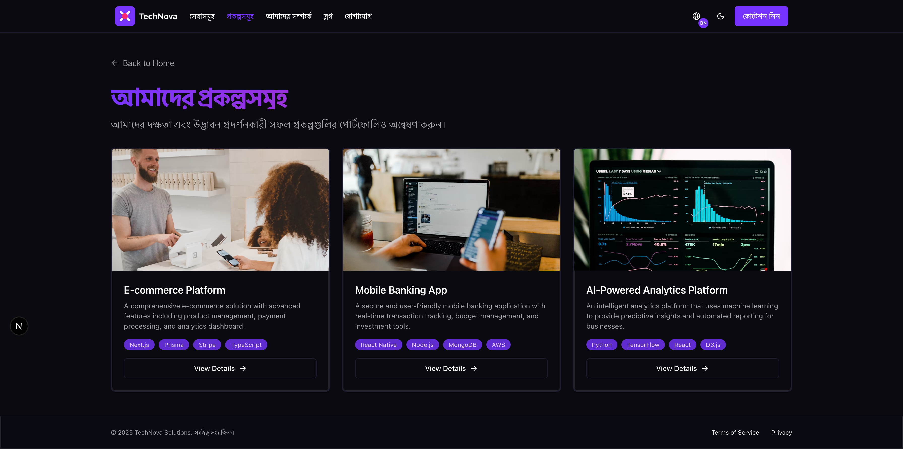
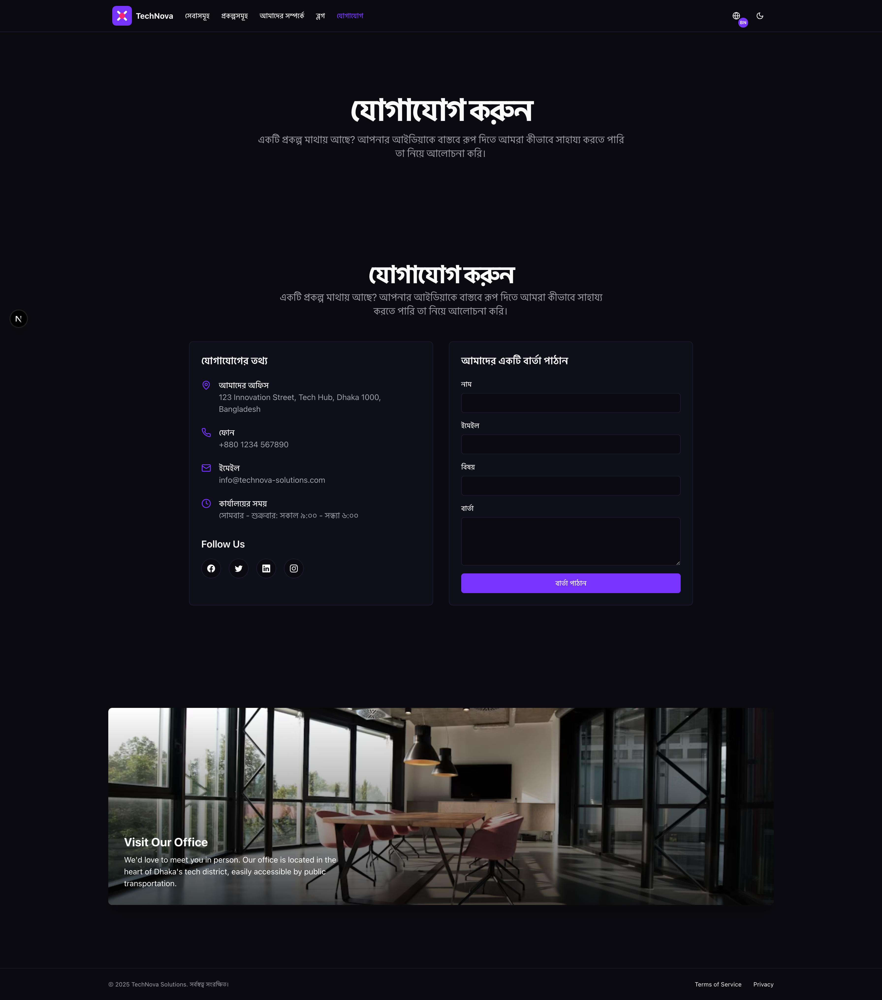
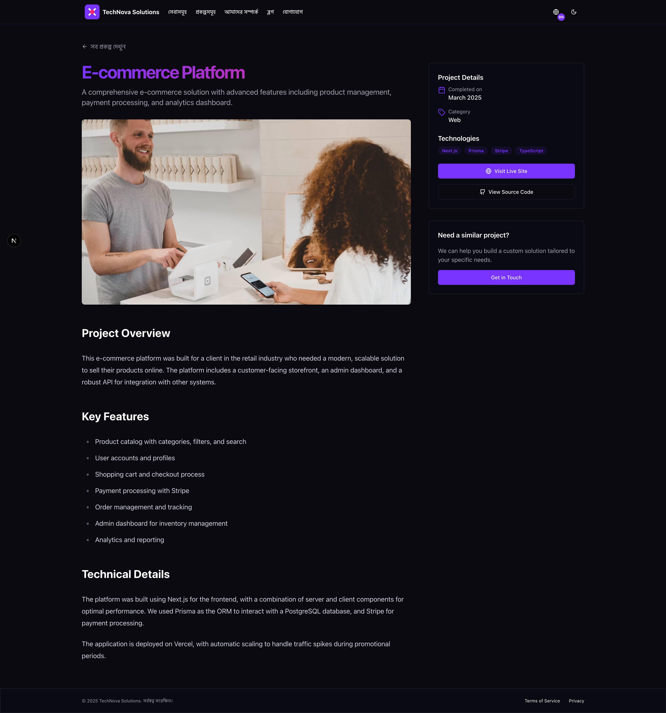
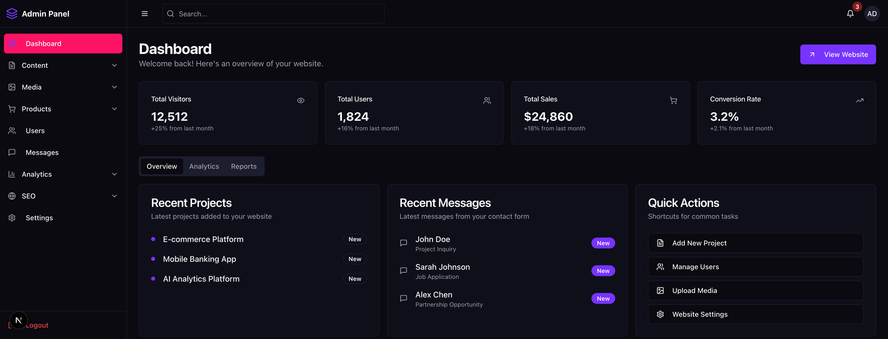
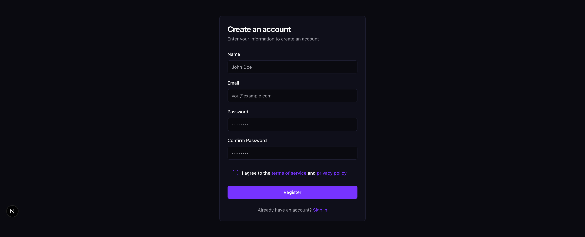

# Easy Setup Landing & Admin Page Using Nextjs v15

## Features
- Multiple pages
- Multiple languages supports
- Multiple themes
- Multiple layouts
- Easy setup
- Admin page
- Landing page
- Customizable
- Mobile Responsive
- SEO friendly
- Easy to deploy
- Easy to maintain
- Multiple components
- Signin and Sign up pages
- Forgot password page
- Admin dashboard

## Tools & Technologies:

`Nextjs v15+`, `React v19+` `Typescript v5+`, and `Tailwindcss v3+`

## Demonstration  

